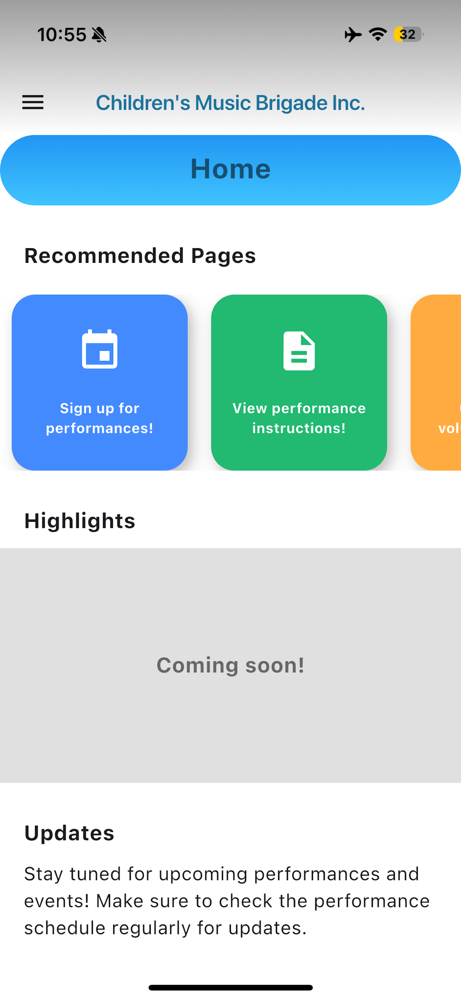
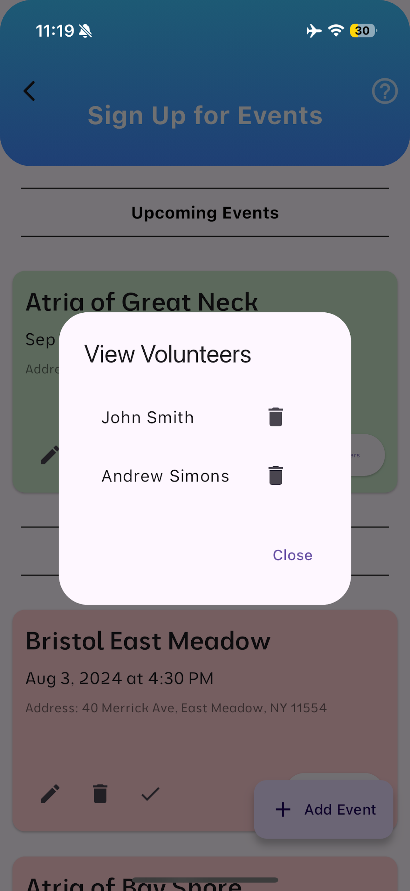
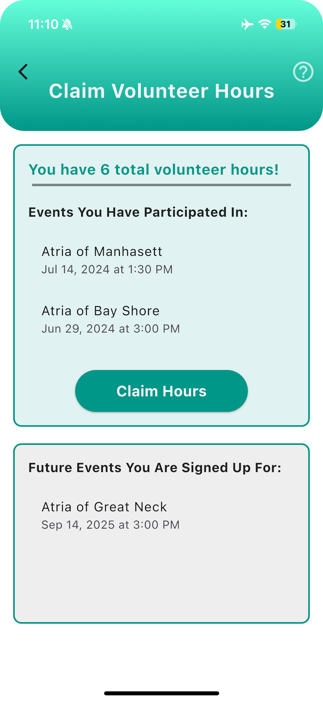
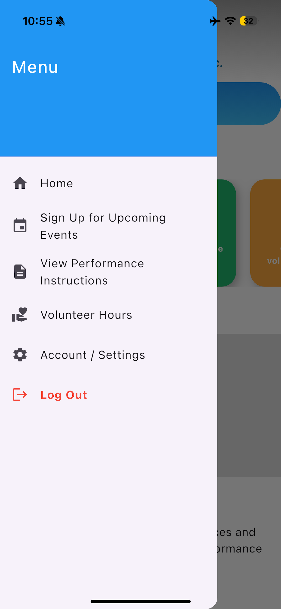
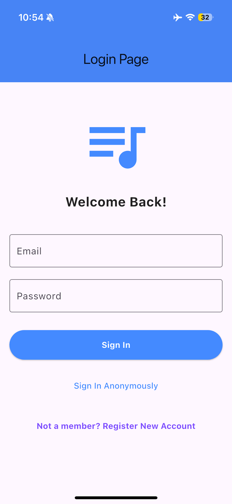

# 🎵 Children’s Music Brigade Mobile App

Connecting high-school musicians with nursing homes and hospitals to bring live music to patients — while making it easy to manage events, volunteers, and hours.


---

## 📚 Table of Contents

- [Overview](#-overview)
- [Features](#-features)
- [Tech Stack](#-tech-stack)
- [App Demo](#-app-demo)
- [App Screens](#app-screens)
- [Project Structure](#project-structure)
- [Getting Started](#getting-started)
  - [Prerequisites](#prerequisites)
  - [Local Setup](#local-setup)
  - [Running the App](#running-the-app)
- [Environment & Configuration](#environment--configuration)
- [Development](#development)
- [Testing](#testing)
- [Deployment](#deployment)
- [Roadmap](#roadmap)
- [Contributing](#contributing)
- [License](#license)
- [Contact](#contact)

---

## 🧩 Overview

Children’s Music Brigade (CMB) is a 501(c)(3) nonprofit that organizes student musicians to perform live music at nursing homes and hospitals.

This app streamlines event organization and volunteer management:

- Organizers can schedule events and track attendance.
- Volunteers can browse upcoming events, sign up, and log hours.
- The organization can scale without spreadsheets or manual reminders.

This repository contains the Flutter + Firebase codebase for the official CMB mobile app.

The current version of the app was developed independently by me.
---

## 🚀 Features

### **For Volunteers**
- 📅 Browse upcoming performances
- 📄 View event details
- ✅ RSVP for events
- ⏱ Track community-service hours
- 🔔 Receive push notifications & reminders

### **For Organizers / Admins**
- 🔐 Role-based access control
- 📝 Create, edit, and archive events
- 👥 View attendance & hours
- 📊 Export data for reporting (optional)

### **General**
- 📱 Cross-platform (Android & iOS)
- ☁️ Realtime Firebase backend
- 🔐 Secure authentication

---

## 🛠 Tech Stack

- **Framework:** Flutter (Dart)
- **Platform:** Android & iOS
- **Backend:** Firebase  
  - Authentication  
  - Realtime Database  
  - Cloud Functions  
  - Cloud Messaging (push notifications)

---

## 🎥 App Demo

**YouTube Demo:**  
[Click Here to Watch!](https://www.youtube.com/watch?v=aPLsThLf-3E)

---

## App Screens

<p float="left">
  
  
  
  
  
  
</p>

---

## Project Structure

```
lib/
 ├── main.dart
 ├── home_page.dart
 ├── upcoming_events_page.dart
 ├── claim_volunteer_hours_page.dart
 ├── instructions_page.dart
 ├── settings_page.dart
 ├── generate_pdf.dart
 ├── decision_tree.dart
 ├── screens/
 │    ├── home_screen.dart
 │    ├── events_screen.dart
 │    ├── event_details.dart
 │    ├── volunteer_hours.dart
 │    └── admin/
 │         ├── admin_dashboard.dart
 │         ├── create_event.dart
 │         ├── admin_panel_page.dart
 │         ├── admin_image_upload_dialog.dart
 ├── widgets/
 │    ├── custom_app_bar.dart
 │    └── loading_button.dart
 ├── models/
 └── services/
      ├── auth/
      │    ├── login_page.dart
      │    └── sign_up_page.dart
      ├── auth_service.dart
      ├── database_service.dart
      └── notification_service.dart

assets/
 ├── images/
 └── icons/

docs/
 └── screens/
      ├── home.png
      ├── events.png
      └── volunteer_hours.png
```

---

## Getting Started

### Prerequisites
- Flutter SDK  
- Dart  
- Xcode (iOS)  
- Android Studio (Android)  
- Firebase project  
- Git  

### Local Setup

Clone the repository:

```bash
git clone https://github.com/your-username/your-repo-name.git
cd your-repo-name
```

Install dependencies:

```bash
flutter pub get
```

### Running the App

iOS Simulator:

```bash
flutter run -d ios
```

Android Emulator:

```bash
flutter run -d android
```

Physical device:

```bash
flutter run
```

---

## Environment & Configuration

Download Firebase config files:

- `GoogleService-Info.plist` → `ios/Runner/`
- `google-services.json` → `android/app/`

Generate Firebase config:

```bash
flutterfire configure
```

Ensure Firebase is initialized in `main.dart`.

---

## Development

Analyze:

```bash
flutter analyze
```

Format:

```bash
dart format .
```

Use hot reload during development.

---

## Testing

Run all tests:

```bash
flutter test
```

Integration tests (if used):

```bash
flutter test integration_test
```

---

## Deployment

### iOS

```bash
flutter build ios --release
```

Then open Xcode → Archive → Upload to App Store.

### Android

APK:

```bash
flutter build apk --release
```

App Bundle:

```bash
flutter build appbundle --release
```

---

## Roadmap

- Add analytics for event attendance  
- Automated email reminders  
- Web admin dashboard  
- Improved data exporting  
- Multi-chapter support  
- Push-notification scheduling  

---

## Contributing

Pull requests and issues are welcome.

---

## License

This project is licensed under the MIT License.

---

## Contact

**Children’s Music Brigade**  
📧 childrensmusicbrigade@gmail.com 
🌐 https://www.childrensmusicbrigade.com/
📱 Maintainer: *Andrew Simons*
